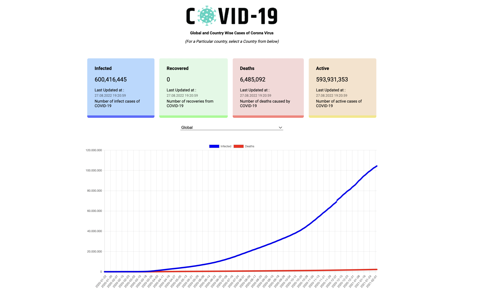
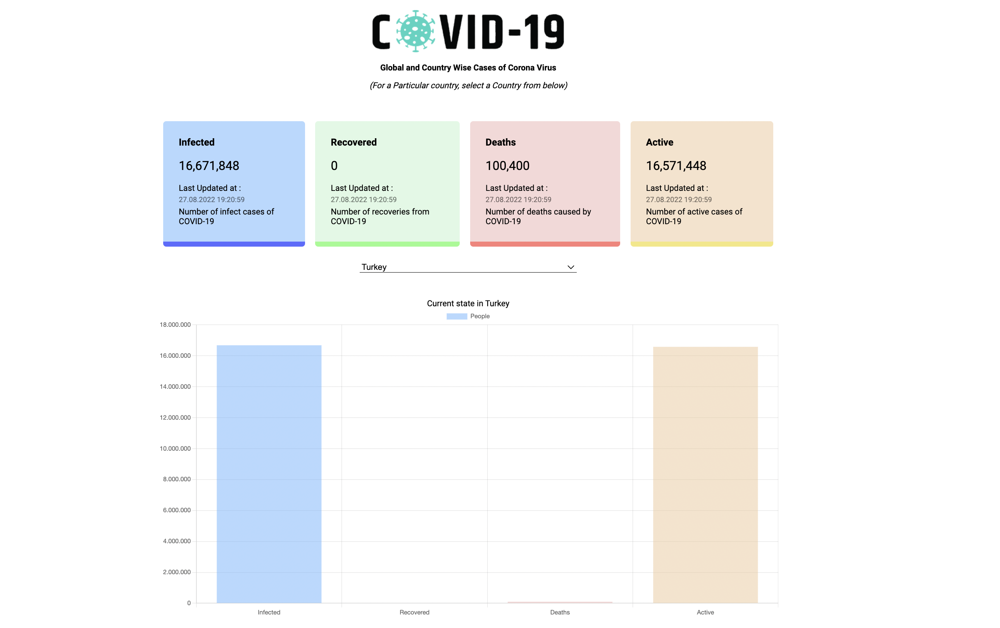

# Redux-Covid19-Tracker




Live: https://cembicakci.github.io/redux-covid19-tracker/

## Tools
* Redux
* createAsyncThunk
* React-CountUp
* React-ChartJs-2
* Axios

## Features
* You can select any country and see the results on chart

## Api
```
https://covid19.mathdro.id/api
```

## Usage
```
npm install
npm start
```